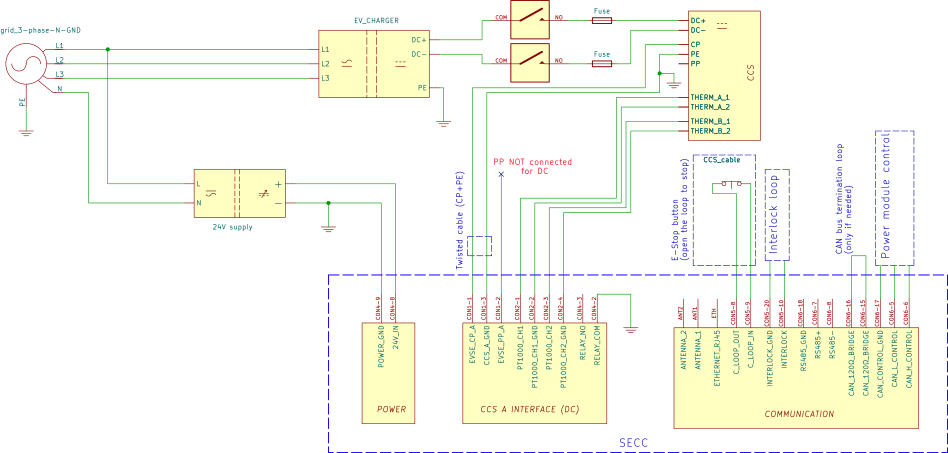
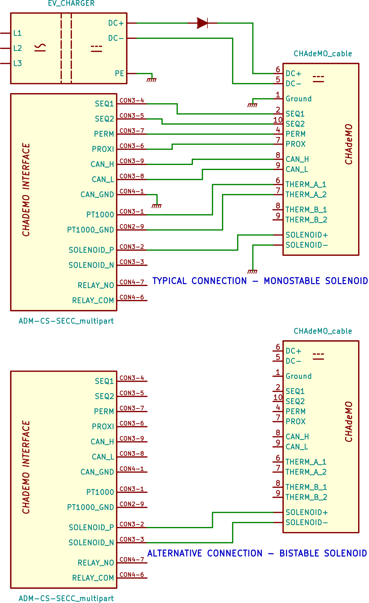

> [!UPDATE] {docsify-updated}
# Examples of use

## Simple CCS DC charge station

A basic single power module DC charge station, with one CCS pistol. Only the essential components shown – the full implementation can also contain temperature control, LCD screen connected over Ethernet, ground fault monitor (if not included in the power modules), RFID reader and similar.

<figcaption style="text-align: center">Figure 10: Simple CCS DC charge station</figcaption>

## Simple CHAdeMO DC charge station

A simple single power module DC charge station, with one CHAdeMO pistol. Only the differences from the CCS diagram are shown. Select the appropriate connection based on your CHAdeMO solenoid type.

<figcaption style="text-align: center">Figure 10: CHAdeMO wiring diagram>
