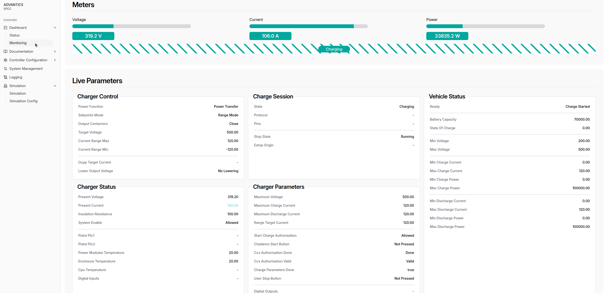

# EVSE Simulation

    🚨 IMPORTANT: This feature is not included in the standard software stack and has to be purchased separately. Please contact <a href="mailto:sales@advantics.fr">sales</a> for more information🚨

---

The primary objective of this software is to simulate a power stack (EVSE) on the charge controller, allowing users to observe and interact with the system without requiring actual power electronics.

# UI

Simulation is primarily managed and controlled by the [CSM Web UI](charge-controllers/advantics_os/csm-web-ui.md). [Connect to your controller](charge-controllers/advantics_os/connecting) dashboard and head to `/dashboard/simulation`.

The interface allows enabling and disabling the simulator in real-time and editing parameters during a simulated charge session. It is divided into three main sections: **Parameters**, **Control**, and **Command**.

## Enabling the simulator

This switch enables or disables the simulation feature.

## Live Editable parameters

### **Parameters (Left Section)**

This section contains charge session and power module related parameters. The user can:

- Edit the **desired values** for each parameter (e.g., voltages, currents, durations).
- View the **actual values** currently active in the system.
- Submit changes by pressing the **“Send”** button at the bottom. No change takes effect until this button is clicked.

Parameters are grouped as follows:

- **Session**: Includes CCS authorisation duration and success result toggle.
- **PowerModules**: Defines technical settings such as voltages, currents, insulation resistance, and charge modules response time.
- **Simulator**: Handles ramp-up/down slopes for voltage and current.

---

### **Control (Middle Section)**

This section provides toggle switches to **enable or disable sending of specific CAN messages**. These toggles can be used to test partial EVSE Generic Interface v3 implementations by disabling the corresponding and giving control to the software under development. Each toggle controls sending of a specific message as listed below.

- **Enable Sending DC Power Parameters**: [DC_Power_Parameters](https://advantics.github.io/documentation/#/charge-controllers/secc_generic/can_v3?id=dc_power_parameters) 
- **Enable Sending Power Modules Status**: [Power_Modules_Status](https://advantics.github.io/documentation/#/charge-controllers/secc_generic/can_v3?id=power_modules_status)
- **Enable Sending Sequence Flags**: [Sequence_Control](https://advantics.github.io/documentation/#/charge-controllers/secc_generic/can_v3?id=sequence_control)

Toggling these switches takes effect immediately and determines whether these data types are being transmitted.

---

### **Command (Right Section)**

This section allows the user to issue manual commands. Each command has its **own action button**:

- **Current Setpoint**: User enters a value and clicks **“Apply”** to send it. Available only in [Range_Mode](https://advantics.github.io/documentation/#/charge-controllers/secc_generic/can_v3?id=bidirectional-power-transfers) bidirectional power transfers. The setpoint will always be limited to the general system limitations such as maximum charge/discharge current limits, cable limits, EV charge current limits. 
- **User Stop Button Pressed**: Clicking **“Stop”** simulates a user stop button press on the charger side.

---

# HOW TO

## Simulating a bidirectional MCS charge session (ISO151180-20) with simulated charger and vehicle, using ADM-CS-SPCC, ADM-CS-MEVC and simulator software stack

1. Update the charge controller configuration for bidirectional power transfer. [Relevant Config Entries](https://advantics.github.io/documentation/#/charge-controllers/secc_generic/secc_bidirectional?id=relevant-config-entries)
2. Enable the [EVSE simulator](charge-controllers/charger-simulation#enabling-the-simulator) with sending all CAN messages enabled. The default simulation configuration can be used.
3. Enable the [PEV simulator](charge-controllers/vehicle-simulation#enabling-the-simulator) with sending all CAN messages enabled.
4. Make sure ADVANTICS vehicle controller configuration option [No BMS mode](charge-controllers/evcc_configuration/no_bms) is **disabled** (set to false).
5. Set the [relevant configuration entries in the vehicle controller](charge-controllers/evcc_bidirectional?id=relevant-config-entries) and [charge station controller](charge-controllers/secc_generic/secc_bidirectional?id=relevant-config-entries) for ISO151180-20.
6. Connect the plug.
7. Head to `dashboard/monitoring` and follow the charge session.

> [!NOTE]
> In case of charge session termination, please wait until the charge controllers go back to idle state before plugging in again.

> [!NOTE]
> In order to run a simulated charge session by using an ADVANTICS charge controller with simulator **on one side**, please make sure the controller on other side is ready to run a charge session without any real power delivered. 

# Hardware Wiring
If you prefer to wire a different hardware to one side of the simulator box, you can follow the connection table below:

### Power Connector

| Number | Label | Color |  
|--------|-------|-------|
| 1 | 24V | Red |
| 2 | GND | Black |

### CAN Bus Connector

| Number | Label | Color |  
|--------|-------|-------|
| 1 | CAN H | Brown |
| 2 | CAN L | Blue |
| 3 | CAN GND | Black |

### MCS Connector

| Number | Label | Color |  
|--------|-------|-------|
| 1 | CE | Orange |
| 2 | ID | White |
| 3 | PHY1 | Purple |
| 4 | PHY2 | Green |
| 5 | PE | Yellow/Green |

# Simulated Charger Configuration Options

This section describes the configuration options available for the simulated charger. The configuration can be modified by using the web interface at `/dashboard/simulation/config`

> [!NOTE]
> The configuration entries and most of the live parameters correspond to each other. The configuration value defines the **default** value to be used then the controller restarts. Any configuration change requires the charge controller applications to restart. The live parameters can be updated at any time, typically between charge sessions to test different behaviors without making permanent changes.

## `pistol_index` (int)

- **Description:** Pistol index used by the simulated charger. Ensure it matches the index configured for your target pistol.
- **Default:** `1`
- **Range:** `1 - 16`
- **Note:** CCS DC defaults to index `1`.

## `ccs_authorisation_duration` (float)

- **Description:** Duration (in seconds) the simulated charger waits before proceeding with CCS authorization.
- **Default:** `3`

## `ccs_authorisation_success` (bool)

- **Description:** Whether the simulated charger should grant CCS authorization at the end of the authorisation duration. This should be enabled to reach the charging state.
- **Default:** `True`

## `charge_params_negotiation_duration` (float)

- **Description:** Duration (in seconds) taken to negotiate charge parameters.
- **Default:** `1.5`

## `power_modules_wake_up_duration` (float)

- **Description:** Time (in seconds) for power modules to wake up.
- **Default:** `1`

## `power_modules_dead_time` (float)

- **Description:** Dead time (in seconds) before power modules start operating.
- **Default:** `1`

## `voltage_ramp_up_slope` (float)

- **Description:** Voltage ramp-up rate in volts per second.
- **Default:** `200`

## `voltage_ramp_down_slope` (float)

- **Description:** Voltage ramp-down rate in volts per second.
- **Default:** `100`

## `current_ramp_up_slope` (float)

- **Description:** Current ramp-up rate in amps per second, once actual charging starts. Determines how quickly the current increases from 0 to the target value.
- **Default:** `20`

## `current_ramp_down_slope` (float)

- **Description:** Current ramp-down rate in amps per second, when charging ends. Determines how quickly the current decreases from the target value to 0.
- **Default:** `20`

## `charge_duration` (float)

- **Description:** Charge session will be stopped automatically after this duration (in seconds). It must be set **before** the `Charging` state, the changes made during `Charging` state will be taken into account for the next charge session.
- **Default:** `10`

## `maximum_voltage` (float)

- **Description:** Maximum voltage accepted by this simulated charger (in volts).
- **Default:** `500`

## `maximum_charge_current` (float)

- **Description:** Maximum output charge current deliverable by the simulated charger (in amps).
- **Default:** `120`

## `maximum_discharge_current` (float)

- **Description:** Maximum output discharge current that the simulated charger can sink (in amps).
- **Default:** `120`

## `insulation_resistance` (float)

- **Description:** Insulation resistance (in ohms) reported after insulation test.
- **Default:** `100`

## `enable_dc_power_parameters` (bool)

- **Description:** Whether the `DC_Power_Parameters` message sent by the simulator should be enabled.
- **Default:** `True`
- Message description: [`dc_power_parameters`](charge-controllers/secc_generic/can_v3?id=dc_power_parameters)

## `enable_power_module_status` (bool)

- **Description:** Whether the `Power_Modules_Status` message sent by the simulator should be enabled.
- **Default:** `True`
- Message description: [`power_modules_status`](charge-controllers/secc_generic/can_v3?id=power_modules_status)

## `enable_sequence_control` (bool)

- **Description:** Whether the `Sequence_Control` message sent by the simulator should be enabled.
- **Default:** `True`
- Message description: [`sequence_control`](charge-controllers/secc_generic/can_v3?id=sequence_control)
