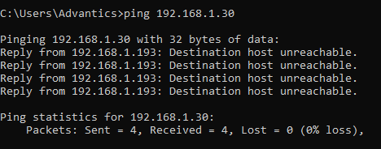
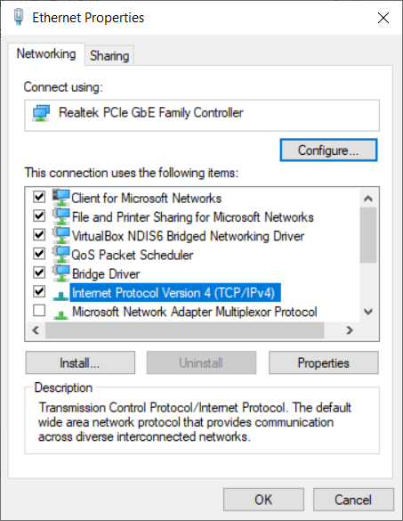
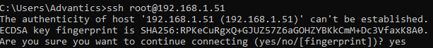

## Accessing the controller

The controller can be accessed in two physical ways: a UART port, and the ethernet RJ45 connector.

### SSH

An SSH server is running on the controller on the standard SSH port, 22. To access it is a matter of knowing the address of the controller.

In the present version, controllers are configured by default for a static IPv4 address:

<div class="small-table compact-table">

| Variant | Static IP | Submask | Gateway |
|---|---|---|---|
| **EVSE** | 192.168.1.51 | 255.255.255.0 | 192.168.1.1
| **PEV** | 192.168.1.49 | 255.255.255.0 | 192.168.1.1

</div>

> [!NOTE] This will change in the future with DHCP addressing by default

The following steps will help access the controller successfully:
<br/><br/>

1. Change the IP address of your system to a different IP address than the controllers. You can do that on Windows by opening "Ethernet Properties" then double-clicking "Internet Protocol Version 4 (TCP/IPv4)". Here you should choose an IP address, not in use by any device on the network.

    You can check that the IP address is not used by pinging it. It should be unreachable:
    ```bash
    $ ping <your IP address>
    ```
    

    The following example is for windows users:

    

    

    
<br/><br/>

2. Access the controller using ssh:

    - Open a terminal (on windows type cmd in the search bar) then use the following command with the IP address of the controller (in the following example it's the default address):

    ```bash
    $ ssh root@192.168.1.51
    ```

    - If you're connecting for the first time, you should accept adding the fingerprint of the controller to the known hosts list, by typing "yes" and pressing enter after this message is shown:

    

    > [!TIP]
    > The controller is also using the _Avahi/ZeroConf/Bonjour/mDNS_ protocol to advertise itself
    > on the network. In particular, the `_ssh._tcp_` service is broadcasted.
    >
    > So, in the simplest case you would just have to do:
    > ```bash
    > $ ssh root@advantics.local
    > ```

3. Access the controller using Putty:

    Download from here:  [https://www.putty.org/](https://www.putty.org/)

    To access the controller you simply need to introduce the IP address then click Open:

    

### Login

On controllers sold for development and prototyping, the login credentials are:

<div class="noheader-table small-table compact-table">

| * | *
|---|---
| **Login** | _root_
| **Password** | _dev-only_

</div>

For controllers meant for series production, the following hardening methods are available.

* Strong, randomized password initialized at first boot of the system after installation.
* Deactivated root account (ie. Ubuntu-like).
* SSH key provisioned on the system, and SSH password login restricted.

## Managing charging applications

### Applications are in containers

We chose to run our applications in Linux containers with Docker for various reasons:

* It simplifies updates for just one application.
* The layering of containers file system makes for lightweight updates.
* Containers use system tools and libs that are independent of the host Buildroot system (which is
more constrained and potentially less up-to-date for some packages).
* Benefit from process and network isolations to further minimize security risks.
* Resources of the system can be limited for each application in case one misbehaves.
* Docker itself can monitor for processes heartbeat and restart them if they fail.

Users are free to use containers or not. If they do, they are also free to use the base images they
want.

Advantics provides base images for Python environment (installed by default). These images are themselves based on Debian 10 (Buster) arm32v7 images provided
directly by Docker, Inc.

### EVSE applications

### Start and stop all

There is a central script for managing all applications at once:
```bash
$ /etc/init.d/S80charger <COMMAND>
```

This script takes one parameter _COMMAND_ which correspond to the following actions:

| **_COMMAND_** | Description |
|---|---|
| start | Start all applications. |
| stop | Stop all applications. |
| restart | Stop and start again all applications. |
| clean | Clean all application logs. Must be done when all applications are stopped. |
| restart-clean | Stop all applications, then clean their logs, then restart them. |

### Individual control

Each application has its own managing script:

<figcaption>Main controller</figcaption>

```bash
$ /srv/run-evse-controller.sh <COMMAND>
```
<br/>
<figcaption>CCS SECC frontend</figcaption>

```bash
$ /srv/run-ccs-secc.sh <COMMAND>
```
<br/>
<figcaption>CCS SLAC frontend</figcaption>

```bash
$ /srv/run-slac-evse.sh <COMMAND>
```

They all take the same _COMMAND_ parameter:

| **_COMMAND_** | Description |
|---|---|
| setup | Prepare the application for running. Automatically called by _start_. |
| start | Start the application. |
| stop | Stop the application. |
| clean | Clean application logs and unprepare it. Must be done when application is stopped. |
| status | Print out the status of the application. |
| logs | Print out the logs and keep following them. Do _CTRL+C_ to exit the log. |
| exportlogs | Takes one exta parameter to give the file name where the logs will be exported to. |

### Export and copy Logs

After exporting the logs of an application with exportlogs command as shown in the following example :

```bash
$ /srv/run-evse-controller.sh exportlogs evselogsname
```

You can download the logs to your system by doing:

```bash
$ scp root@<controllerIPAddress>:<LogsPath> <DestinationPath>
```
You should replace <controllerIPAddress> with the IP address of the controller, <LogsPath> with the logs path on the controller, and <DestinationPath> with the destination folder on your system. The following is an example:
```bash
$ scp root@192.168.1.51:/root/evselogsname .
```

If you're having trouble with copying the logs to your system, you can use WINSCP application. Download and documentation available here: [https://winscp.net/eng/download.php](https://winscp.net/eng/download.php)


&nbsp;

---

### ADVANTICS charge controller Documentation is available here:
### [https://advantics.github.io/documentation/#/charge-controllers/](https://advantics.github.io/documentation/#/charge-controllers/)