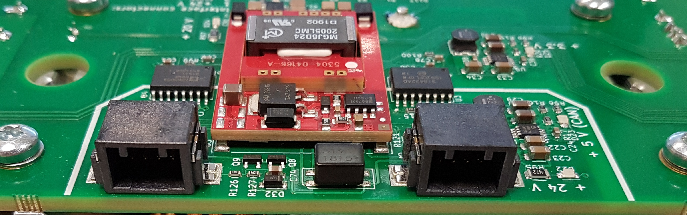

# Communication interface

All ADVANTICS modules have a common interface for control and readout. The interface consists of a CAN bus for control and status reporting, and an interlock line (INTLK) for safety. Additionally, the interface connectors also include power distribution for the control section of the modules. Each module is provided with two interface connectors that are completely identical in pinout, allowing chaining of the modules without using branched cables or a distribution hub.

<figcaption style="text-align: center">Example of a power module with two interface
connectors</figcaption>

### CAN bus

The communication with ADVANTICS power modules is realized over CAN bus 2.0B, with data rate of 500 kbit/s and extended addressing. Please see the module CAN database section for the protocol description. 
Up to 32 modules of the same type can be chained, limited by the available addresses. The modules of different type do not collide with each other on the addresses.

### CAN bus termination

CAN bus termination is necessary for correct operation. To ensure stable communications and good noise margin, no more or less than two termination resistors should be present on the CAN bus, ideally at each end of the chain. If the CAN bus is branched, the termination resistors should be placed at the two points farthest away in the chain, and unterminated branches should be kept at minimum length.

The power module contains an on-board CAN termination resistor per each CPT connector, which can be activated by bridging pins 6 and 3 of the CPT connector with a simple wire (shown on the chaining diagram). The wire used to bridge pins 6 and 3 should be as short as possible to minimize noise pickup, less than 5 cm.

### Interlock line

The interlock pin on the interface connector is used to put the system in a safe state, independent of the CAN communications, for user safety and in case of faults. The interlock line is normally pulled high by pull-up resistors to +24 V on each individual modules, and any module can pull the line low to put the whole system in a safe state (that is, to trigger the system-wide interlock). Each module has 4k7 Ohm pull-up resistor. Interlock is latching from the module causing it – it will be unlatched by the CPU request (CAN bus request from the user system). Other modules in the system will not latch external interlocks, they will simply act upon them. Interlock is purely HW-based system, using logic gates and comparators. The CPU cannot overrule the interlock.

> [!NOTE]
> All modules starts with tripped interlock after reset.
> The user must request interlock clear over the CAN bus. Otherwise the module cannot be started.

### Interface power supply

Control power for the modules is nominally +24 V DC. Upper and lower limits and maximum current draw are given in the Specification Sheet. Two pins each are used for +24 V and ground to minimize voltage drop across the wires in installations with a large number of modules and/or long wiring. When planning the communications chain, ensure that no single connector is carrying more than 3 A in total, given the worst-case current requirement of the individual modules. Note that in larger installations, the voltage drop across the wires can be significant, and this will affect the supply voltage of the individual modules.

Voltage drop across the communications ground wires will change the apparent logic levels at each module. Ensure that the voltage drop between any two modules does not exceed 1 volt. The nominal resistance of the recommended wire is 50 milliohms per meter. Two wires are used in parallel for ground, giving a total ground resistance of 25 milliohms per meter.